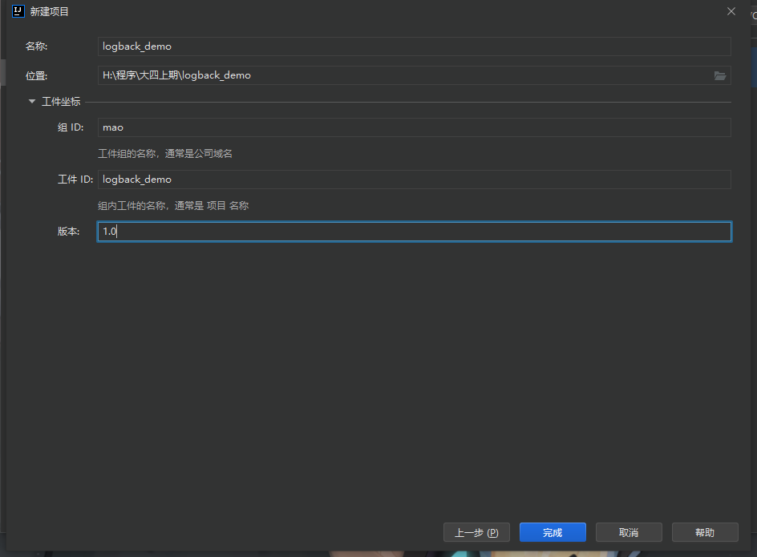

# logback

## 介绍

Logback继承自log4j。Logback的架构非常的通用，适用于不同的使用场景。


logback和Log4j都是slf4j规范的具体实现，我们在程序中直接调用的API其实都是slf4j的api，底层则是真正的日志实现组件---logback或者log4j。

Logback 构建在三个主要的类上：Logger，Appender 和 Layout。这三个不同类型的组件一起作用能够让开发者根据消息的类型以及日志的级别来打印日志。 


**Logger**作为日志的记录器，把它关联到应用的对应的context后，主要用于存放日志对象，也可以定义日志类型、级别。各个logger 都被关联到一个 LoggerContext，LoggerContext负责制造logger，也负责以树结构排列各 logger。

**Appender**主要用于指定日志输出的目的地，目的地可以是控制台、文件、 数据库等。

**Layout** 负责把事件转换成字符串，输出格式化的日志信息。


logback的maven坐标：

```xml
<dependency>
    <groupId>ch.qos.logback</groupId>
    <artifactId>logback-classic</artifactId>
    <version>1.2.3</version>
</dependency>
<dependency>
    <groupId>ch.qos.logback</groupId>
    <artifactId>logback-core</artifactId>
    <version>1.2.3</version>
</dependency>
```


## logback层级

在 logback中每一个 logger 都依附在 LoggerContext 上，它负责产生 logger，并且通过一个**树状**的层级结构来进行管理。

一个 Logger 被当作为一个实体，它们的命名是大小写敏感的，并且遵循以下规则：

* 如果一个logger的名字加上一个.作为另一个logger名字的前缀，那么该logger就是另一个logger的祖先。如果一个logger与另一个logger之间没有其它的logger，则该logger就是另一个logger的父级。


在logback中有一个root logger，它是logger层次结构的最高层，它是一个特殊的logger，因为它是每一个层次结构的一部分


## logback日志输出等级

logback的日志输出等级分为：TRACE, DEBUG, INFO, WARN, ERROR。

如果一个给定的logger没有指定一个日志输出等级，那么它就会继承离它最近的一个祖先的层级。

为了确保所有的logger都有一个日志输出等级，root logger会有一个默认输出等级 --- DEBUG。


## logback初始化步骤

1. logback会在类路径下寻找名为logback-test.xml的文件
2. 如果没有找到，logback会继续寻找名为logback.groovy的文件
3. 如果没有找到，logback会继续寻找名为logback.xml的文件
4. 如果没有找到，将会在类路径下寻找文件META-INFO/services/ch.qos.logback.classic.spi.Configurator，该文件的内容为实现了Configurator接口的实现类的全限定类名
5. 如果以上都没有成功，logback会通过BasicConfigurator为自己进行配置，并且日志将会全部在控制台打印出来

最后一步的目的是为了保证在所有的配置文件都没有被找到的情况下，提供一个默认的配置。


## logback入门案例

### 案例一


#### 第一步：创建maven工程logback_demo





#### 第二步：修改pom文件


```xml
<?xml version="1.0" encoding="UTF-8"?>
<project xmlns="http://maven.apache.org/POM/4.0.0"
         xmlns:xsi="http://www.w3.org/2001/XMLSchema-instance"
         xsi:schemaLocation="http://maven.apache.org/POM/4.0.0 http://maven.apache.org/xsd/maven-4.0.0.xsd">
    <modelVersion>4.0.0</modelVersion>
    <!--
      -maven项目核心配置文件-
    Project name(项目名称)：logback_demo
    Author(作者）: mao
    Author QQ：1296193245
    GitHub：https://github.com/maomao124/
    Date(创建日期)： 2022/10/31
    Time(创建时间)： 18:52
    -->
    <groupId>mao</groupId>
    <artifactId>logback_demo</artifactId>
    <version>1.0</version>

    <properties>
        <maven.compiler.source>16</maven.compiler.source>
        <maven.compiler.target>16</maven.compiler.target>
    </properties>
    
    <dependencies>

        <dependency>
            <groupId>ch.qos.logback</groupId>
            <artifactId>logback-classic</artifactId>
            <version>1.3.4</version>
        </dependency>
        <dependency>
            <groupId>ch.qos.logback</groupId>
            <artifactId>logback-core</artifactId>
            <version>1.3.4</version>
        </dependency>

        <!-- 测试框架 -->
        <dependency>
            <groupId>org.junit.jupiter</groupId>
            <artifactId>junit-jupiter</artifactId>
            <version>RELEASE</version>
            <scope>test</scope>
        </dependency>

    </dependencies>

    <build>
        <finalName>logback_demo</finalName>
        <plugins>
            <plugin>
                <groupId>org.apache.maven.plugins</groupId>
                <artifactId>maven-jar-plugin</artifactId>
                <configuration>
                    <archive>
                        <manifest>
                            <mainClass>Test</mainClass>
                            <!--更改项，主类名-->
                        </manifest>
                    </archive>
                </configuration>
            </plugin>
        </plugins>
    </build>

</project>
```


#### 第三步：编写单元测试


```java
package mao;

import ch.qos.logback.classic.Level;
import ch.qos.logback.classic.LoggerContext;
import ch.qos.logback.core.util.StatusPrinter;
import org.junit.jupiter.api.Test;
import org.slf4j.Logger;
import org.slf4j.LoggerFactory;

/**
 * Project name(项目名称)：logback_demo
 * Package(包名): mao
 * Class(类名): LogbackTest
 * Author(作者）: mao
 * Author QQ：1296193245
 * GitHub：https://github.com/maomao124/
 * Date(创建日期)： 2022/10/31
 * Time(创建时间)： 18:56
 * Version(版本): 1.0
 * Description(描述)： 无
 */


public class LogbackTest
{
    //简单使用
    @Test
    public void test1()
    {
        Logger logger = LoggerFactory.getLogger("mao.logback.HelloWorld");
        logger.debug("debug ...");
    }

    //打印日志内部状态
    @Test
    public void test2()
    {
        Logger logger = LoggerFactory.getLogger("mao.logback.HelloWorld");
        logger.debug("debug ...");
        // 打印内部的状态
        LoggerContext lc = (LoggerContext) LoggerFactory.getILoggerFactory();
        StatusPrinter.print(lc);
    }

    /*
     * 日志输出级别：ERROR > WARN > INFO > DEBUG > TRACE
     * */

    //测试默认的日志输出级别
    @Test
    public void test3()
    {
        Logger logger = LoggerFactory.getLogger("mao.logback.HelloWorld");
        logger.error("error ...");
        logger.warn("warn ...");
        logger.info("info ...");
        logger.debug("debug ...");
        //因为默认的输出级别为debug，所以这一条日志不会输出
        logger.trace("trace ...");
    }

    //设置日志输出级别
    @Test
    public void test4()
    {
        ch.qos.logback.classic.Logger logger = (ch.qos.logback.classic.Logger) LoggerFactory.getLogger("mao.logback.HelloWorld");
        logger.setLevel(Level.WARN);
        logger.error("error ...");
        logger.warn("warn ...");
        logger.info("info ...");
        logger.debug("debug ...");
        logger.trace("trace ...");
    }

    //测试Logger的继承
    @Test
    public void test5()
    {
        ch.qos.logback.classic.Logger logger =
                (ch.qos.logback.classic.Logger) LoggerFactory.getLogger("mao");
        logger.setLevel(Level.INFO);
        logger.error("error ...");
        logger.warn("warn ...");
        logger.info("info ...");
        logger.debug("debug ...");
        logger.trace("trace ...");

        // "mao.logback" 会继承 "mao" 的有效级别
        Logger barLogger = LoggerFactory.getLogger("mao.logback");
        // 这条日志会打印，因为 INFO >= INFO
        barLogger.info("子级信息");
        // 这条日志不会打印，因为 DEBUG < INFO
        barLogger.debug("子级调试信息");
    }

    //Logger获取，根据同一个名称获得的logger都是同一个实例
    @Test
    public void test6()
    {
        Logger logger1 = LoggerFactory.getLogger("mao");
        Logger logger2 = LoggerFactory.getLogger("mao");
        System.out.println(logger1 == logger2);
    }

    //参数化日志
    @Test
    public void test7()
    {
        Logger logger = LoggerFactory.getLogger("mao");
        logger.debug("hello {}", "world");
    }
}
```


### 案例二


#### 第一步：创建springboot工程springboot_logback_demo


#### 第二步：修改pom文件


```xml
<?xml version="1.0" encoding="UTF-8"?>
<project xmlns="http://maven.apache.org/POM/4.0.0" xmlns:xsi="http://www.w3.org/2001/XMLSchema-instance"
         xsi:schemaLocation="http://maven.apache.org/POM/4.0.0 https://maven.apache.org/xsd/maven-4.0.0.xsd">
    <modelVersion>4.0.0</modelVersion>
    <parent>
        <groupId>org.springframework.boot</groupId>
        <artifactId>spring-boot-starter-parent</artifactId>
        <version>2.7.1</version>
        <relativePath/> <!-- lookup parent from repository -->
    </parent>
    <groupId>mao</groupId>
    <artifactId>springboot_logback_demo</artifactId>
    <version>0.0.1-SNAPSHOT</version>
    <name>springboot_logback_demo</name>
    <description>springboot_logback_demo</description>
    <properties>
        <java.version>11</java.version>
    </properties>
    <dependencies>
        <dependency>
            <groupId>org.springframework.boot</groupId>
            <artifactId>spring-boot-starter-web</artifactId>
        </dependency>

        <dependency>
            <groupId>org.springframework.boot</groupId>
            <artifactId>spring-boot-starter-test</artifactId>
            <scope>test</scope>
        </dependency>

        <!--logback-->
        <dependency>
            <groupId>ch.qos.logback</groupId>
            <artifactId>logback-classic</artifactId>
            <version>1.2.3</version>
        </dependency>
        <dependency>
            <groupId>ch.qos.logback</groupId>
            <artifactId>logback-core</artifactId>
            <version>1.2.3</version>
        </dependency>

    </dependencies>

    <build>
        <plugins>
            <plugin>
                <groupId>org.springframework.boot</groupId>
                <artifactId>spring-boot-maven-plugin</artifactId>
            </plugin>
        </plugins>
    </build>

</project>

```


#### 第三步：在resources下编写logback配置文件logback-base.xml


```xml
<?xml version="1.0" encoding="UTF-8"?>
<included>
    <contextName>logback</contextName>
    <!--
      name的值是变量的名称，value的值时变量定义的值
      定义变量后，可以使“${}”来使用变量
   -->
    <property name="log.path" value="./logs"/>

    <!-- 彩色日志 -->
    <!-- 彩色日志依赖的渲染类 -->
    <conversionRule
            conversionWord="clr"
            converterClass="org.springframework.boot.logging.logback.ColorConverter"/>
    <conversionRule
            conversionWord="wex"
            converterClass="org.springframework.boot.logging.logback.WhitespaceThrowableProxyConverter"/>
    <conversionRule conversionWord="wEx"
                    converterClass="org.springframework.boot.logging.logback.ExtendedWhitespaceThrowableProxyConverter"/>
    <!-- 彩色日志格式 -->
    <property name="CONSOLE_LOG_PATTERN"
              value="${CONSOLE_LOG_PATTERN:-%clr(%d{yyyy-MM-dd HH:mm:ss.SSS}){faint} %clr(${LOG_LEVEL_PATTERN:-%5p}) %clr(${PID:- }){magenta} %clr(---){faint} %clr([%15.15t]){faint} %clr(%-40.40logger{39}){cyan} %clr(:){faint} %m%n${LOG_EXCEPTION_CONVERSION_WORD:-%wEx}}"/>

    <!--输出到控制台-->
    <appender name="LOG_CONSOLE" class="ch.qos.logback.core.ConsoleAppender">
        <encoder>
            <Pattern>${CONSOLE_LOG_PATTERN}</Pattern>
            <!-- 设置字符集 -->
            <charset>UTF-8</charset>
        </encoder>
    </appender>

    <!--输出到文件-->
    <appender name="LOG_FILE" class="ch.qos.logback.core.rolling.RollingFileAppender">
        <!-- 正在记录的日志文件的路径及文件名 -->
        <file>${log.path}/logback.log</file>
        <!--日志文件输出格式-->
        <encoder>
            <pattern>%d{yyyy-MM-dd HH:mm:ss.SSS} [%thread] %-5level %logger{50} - %msg%n</pattern>
            <charset>UTF-8</charset>
        </encoder>
        <!-- 日志记录器的滚动策略，按日期，按大小记录 -->
        <rollingPolicy class="ch.qos.logback.core.rolling.TimeBasedRollingPolicy">
            <!-- 每天日志归档路径以及格式 -->
            <fileNamePattern>${log.path}/info/log-info-%d{yyyy-MM-dd}.%i.log</fileNamePattern>
            <timeBasedFileNamingAndTriggeringPolicy class="ch.qos.logback.core.rolling.SizeAndTimeBasedFNATP">
                <maxFileSize>10MB</maxFileSize>
            </timeBasedFileNamingAndTriggeringPolicy>
            <!--日志文件保留天数-->
            <maxHistory>365</maxHistory>
        </rollingPolicy>
    </appender>
</included>
```


#### 第四步：在resources下编写logback配置文件logback-spring.xml


```xml
<?xml version="1.0" encoding="UTF-8"?>
<configuration>
    <!--引入其他配置文件-->
    <include resource="logback-base.xml"/>
    <!--
    <logger>用来设置某一个包或者具体的某一个类的日志打印级别、
    以及指定<appender>。<logger>仅有一个name属性，
    一个可选的level和一个可选的addtivity属性。
    name:用来指定受此logger约束的某一个包或者具体的某一个类。
    level:用来设置打印级别，大小写无关：TRACE, DEBUG, INFO, WARN, ERROR, ALL 和 OFF，
          如果未设置此属性，那么当前logger将会继承上级的级别。
    addtivity:是否向上级logger传递打印信息。默认是true。
     -->

    <!--开发环境-->
<!--    <springProfile name="dev">-->
<!--        <logger name="包名" additivity="false" level="debug">-->
<!--            <appender-ref ref="LOG_CONSOLE"/>-->
<!--        </logger>-->
<!--    </springProfile>-->
<!--    &lt;!&ndash;生产环境&ndash;&gt;-->
<!--    <springProfile name="pro">-->
<!--        <logger name="包名" additivity="false" level="info">-->
<!--            <appender-ref ref="LOG_FILE"/>-->
<!--        </logger>-->
<!--    </springProfile>-->

    <!--
    root节点是必选节点，用来指定最基础的日志输出级别，只有一个level属性
    level:设置打印级别，大小写无关：TRACE, DEBUG, INFO, WARN, ERROR, ALL 和 OFF 默认是DEBUG
    可以包含零个或多个元素，标识这个appender将会添加到这个logger。
    -->
    <root level="info">
        <appender-ref ref="LOG_CONSOLE"/>
        <appender-ref ref="LOG_FILE"/>
    </root>
</configuration>
```


#### 第五步：编写application.yml文件


```yaml
logging:
  config: classpath:logback-spring.xml

spring:
  profiles:
    active: dev
```


#### 第六步：创建并编写UserController


```java
package mao.springboot_logback_demo.controller;

import org.slf4j.Logger;
import org.slf4j.LoggerFactory;
import org.springframework.web.bind.annotation.GetMapping;
import org.springframework.web.bind.annotation.RequestMapping;
import org.springframework.web.bind.annotation.RestController;

/**
 * Project name(项目名称)：springboot_logback_demo
 * Package(包名): mao.springboot_logback_demo.controller
 * Class(类名): UserController
 * Author(作者）: mao
 * Author QQ：1296193245
 * GitHub：https://github.com/maomao124/
 * Date(创建日期)： 2022/10/31
 * Time(创建时间)： 19:24
 * Version(版本): 1.0
 * Description(描述)： 无
 */

@RestController
@RequestMapping("/user")
public class UserController
{
    private static final Logger log = LoggerFactory.getLogger(UserController.class);

    @GetMapping("/get")
    public String get()
    {
        log.trace("trace...");
        log.debug("debug...");
        log.info("info...");
        log.warn("warn...");
        log.error("error...");
        return "OK";
    }
}
```


#### 第七步：启动并访问


http://localhost:8080/user/get


可以看到控制台已经开始输出日志信息。

修改application.yml文件中的开发模式为pro，重启项目这日志输出到了文件中。


## Spring Event

### 介绍

Spring Event是Spring的事件通知机制，可以将相互耦合的代码解耦，从而方便功能的修改与添加。Spring Event是监听者模式的一个具体实现。

监听者模式包含了监听者Listener、事件Event、事件发布者EventPublish，过程就是EventPublish发布一个事件，被监听者捕获到，然后执行事件相应的方法。

Spring Event的相关API在spring-context包中。


### Spring Event入门案例


第一步：创建工程spring_event_demo


pom文件：

```xml
<?xml version="1.0" encoding="UTF-8"?>
<project xmlns="http://maven.apache.org/POM/4.0.0" xmlns:xsi="http://www.w3.org/2001/XMLSchema-instance"
         xsi:schemaLocation="http://maven.apache.org/POM/4.0.0 https://maven.apache.org/xsd/maven-4.0.0.xsd">
    <modelVersion>4.0.0</modelVersion>
    <parent>
        <groupId>org.springframework.boot</groupId>
        <artifactId>spring-boot-starter-parent</artifactId>
        <version>2.7.1</version>
        <relativePath/> <!-- lookup parent from repository -->
    </parent>
    <groupId>mao</groupId>
    <artifactId>spring_event_demo</artifactId>
    <version>0.0.1-SNAPSHOT</version>
    <name>spring_event_demo</name>
    <description>spring_event_demo</description>
    <properties>
        <java.version>11</java.version>
    </properties>
    <dependencies>
        <dependency>
            <groupId>org.springframework.boot</groupId>
            <artifactId>spring-boot-starter-web</artifactId>
        </dependency>

        <dependency>
            <groupId>org.springframework.boot</groupId>
            <artifactId>spring-boot-starter-test</artifactId>
            <scope>test</scope>
        </dependency>
    </dependencies>

    <build>
        <plugins>
            <plugin>
                <groupId>org.springframework.boot</groupId>
                <artifactId>spring-boot-maven-plugin</artifactId>
            </plugin>
        </plugins>
    </build>

</project>
```


第二步：创建OptLogDTO类，用于封装操作日志信息


```java
package mao.spring_event_demo.entity;

/**
 * Project name(项目名称)：spring_event_demo
 * Package(包名): mao.spring_event_demo.entity
 * Class(类名): OptLogDTO
 * Author(作者）: mao
 * Author QQ：1296193245
 * GitHub：https://github.com/maomao124/
 * Date(创建日期)： 2022/10/31
 * Time(创建时间)： 20:01
 * Version(版本): 1.0
 * Description(描述)： 无
 */


public class OptLogDTO
{
    /**
     * 操作IP
     */
    private String requestIp;

    /**
     * 日志类型 LogType{OPT:操作类型;EX:异常类型}
     */
    private String type;

    /**
     * 操作人
     */
    private String userName;

    /**
     * 操作描述
     */
    private String description;

    /**
     * Instantiates a new Opt log dto.
     */
    public OptLogDTO()
    {

    }

    /**
     * Instantiates a new Opt log dto.
     *
     * @param requestIp   the request ip
     * @param type        the type
     * @param userName    the user name
     * @param description the description
     */
    public OptLogDTO(String requestIp, String type, String userName, String description)
    {
        this.requestIp = requestIp;
        this.type = type;
        this.userName = userName;
        this.description = description;
    }

    /**
     * Gets request ip.
     *
     * @return the request ip
     */
    public String getRequestIp()
    {
        return requestIp;
    }

    /**
     * Sets request ip.
     *
     * @param requestIp the request ip
     */
    public void setRequestIp(String requestIp)
    {
        this.requestIp = requestIp;
    }

    /**
     * Gets type.
     *
     * @return the type
     */
    public String getType()
    {
        return type;
    }

    /**
     * Sets type.
     *
     * @param type the type
     */
    public void setType(String type)
    {
        this.type = type;
    }

    /**
     * Gets user name.
     *
     * @return the user name
     */
    public String getUserName()
    {
        return userName;
    }

    /**
     * Sets user name.
     *
     * @param userName the user name
     */
    public void setUserName(String userName)
    {
        this.userName = userName;
    }

    /**
     * Gets description.
     *
     * @return the description
     */
    public String getDescription()
    {
        return description;
    }

    /**
     * Sets description.
     *
     * @param description the description
     */
    public void setDescription(String description)
    {
        this.description = description;
    }

    @Override
    public boolean equals(Object o)
    {
        if (this == o)
        {
            return true;
        }
        if (o == null || getClass() != o.getClass())
        {
            return false;
        }

        OptLogDTO optLogDTO = (OptLogDTO) o;

        if (getRequestIp() != null ? !getRequestIp().equals(optLogDTO.getRequestIp()) : optLogDTO.getRequestIp() != null)
        {
            return false;
        }
        if (getType() != null ? !getType().equals(optLogDTO.getType()) : optLogDTO.getType() != null)
        {
            return false;
        }
        if (getUserName() != null ? !getUserName().equals(optLogDTO.getUserName()) : optLogDTO.getUserName() != null)
        {
            return false;
        }
        return getDescription() != null ? getDescription().equals(optLogDTO.getDescription()) : optLogDTO.getDescription() == null;
    }

    @Override
    public int hashCode()
    {
        int result = getRequestIp() != null ? getRequestIp().hashCode() : 0;
        result = 31 * result + (getType() != null ? getType().hashCode() : 0);
        result = 31 * result + (getUserName() != null ? getUserName().hashCode() : 0);
        result = 31 * result + (getDescription() != null ? getDescription().hashCode() : 0);
        return result;
    }

    @Override
    public String toString()
    {
        final StringBuffer stringBuffer = new StringBuffer("OptLogDTO{");
        stringBuffer.append("requestIp='").append(requestIp).append('\'');
        stringBuffer.append(", type='").append(type).append('\'');
        stringBuffer.append(", userName='").append(userName).append('\'');
        stringBuffer.append(", description='").append(description).append('\'');
        stringBuffer.append('}');
        return stringBuffer.toString();
    }
}

```


第三步：创建事件类SysLogEvent


```java
package mao.spring_event_demo.event;

import mao.spring_event_demo.entity.OptLogDTO;
import org.springframework.context.ApplicationEvent;

/**
 * Project name(项目名称)：spring_event_demo
 * Package(包名): mao.spring_event_demo.event
 * Class(类名): SysLogEvent
 * Author(作者）: mao
 * Author QQ：1296193245
 * GitHub：https://github.com/maomao124/
 * Date(创建日期)： 2022/10/31
 * Time(创建时间)： 20:03
 * Version(版本): 1.0
 * Description(描述)： 无
 */

public class SysLogEvent extends ApplicationEvent
{
    public SysLogEvent(OptLogDTO optLogDTO)
    {
        super(optLogDTO);
    }
}
```


第四步：创建监听器类SysLogListener


```java
package mao.spring_event_demo.listener;

import mao.spring_event_demo.entity.OptLogDTO;
import mao.spring_event_demo.event.SysLogEvent;
import org.slf4j.Logger;
import org.slf4j.LoggerFactory;
import org.springframework.context.event.EventListener;
import org.springframework.scheduling.annotation.Async;
import org.springframework.stereotype.Component;

import javax.annotation.PostConstruct;

/**
 * Project name(项目名称)：spring_event_demo
 * Package(包名): mao.spring_event_demo.listener
 * Class(类名): SysLogListener
 * Author(作者）: mao
 * Author QQ：1296193245
 * GitHub：https://github.com/maomao124/
 * Date(创建日期)： 2022/10/31
 * Time(创建时间)： 20:05
 * Version(版本): 1.0
 * Description(描述)： 无
 */

@Component
public class SysLogListener
{
    private static final Logger log = LoggerFactory.getLogger(SysLogListener.class);

    @Async
    @EventListener(SysLogEvent.class)
    public void saveSysLog(SysLogEvent event)
    {
        OptLogDTO sysLog = (OptLogDTO) event.getSource();
        long id = Thread.currentThread().getId();
        log.info("监听到日志操作事件：" + sysLog + " 线程id：" + id);
        //将日志信息保存到数据库或者其它地方

    }

    @PostConstruct
    public void init()
    {
        log.info("初始化SysLogListener");
    }
}

```


第五步：创建Controller，用于发布事件


```java
package mao.spring_event_demo.controller;

import mao.spring_event_demo.entity.OptLogDTO;
import mao.spring_event_demo.event.SysLogEvent;
import org.slf4j.Logger;
import org.slf4j.LoggerFactory;
import org.springframework.beans.factory.annotation.Autowired;
import org.springframework.context.ApplicationContext;
import org.springframework.context.ApplicationEvent;
import org.springframework.web.bind.annotation.GetMapping;
import org.springframework.web.bind.annotation.RequestMapping;
import org.springframework.web.bind.annotation.RestController;

/**
 * Project name(项目名称)：spring_event_demo
 * Package(包名): mao.spring_event_demo.controller
 * Class(类名): UserController
 * Author(作者）: mao
 * Author QQ：1296193245
 * GitHub：https://github.com/maomao124/
 * Date(创建日期)： 2022/10/31
 * Time(创建时间)： 20:09
 * Version(版本): 1.0
 * Description(描述)： 无
 */

@RestController
@RequestMapping("/user")
public class UserController
{
    @Autowired
    private ApplicationContext applicationContext;

    private static final Logger log = LoggerFactory.getLogger(UserController.class);

    @GetMapping("/getUser")
    public String getUser()
    {
        //构造操作日志信息
        OptLogDTO logInfo = new OptLogDTO();
        logInfo.setRequestIp("127.0.0.1");
        logInfo.setUserName("admin");
        logInfo.setType("OPT");
        logInfo.setDescription("查询用户信息");

        //构造事件对象
        ApplicationEvent event = new SysLogEvent(logInfo);

        //发布事件
        applicationContext.publishEvent(event);

        long id = Thread.currentThread().getId();
        log.info("发布事件,线程id：" + id);
        return "OK";
    }
}

```


第六步：在启动类上添加EnableAsync注解


```java
package mao.spring_event_demo;

import org.springframework.boot.SpringApplication;
import org.springframework.boot.autoconfigure.SpringBootApplication;
import org.springframework.scheduling.annotation.EnableAsync;

@SpringBootApplication
@EnableAsync
public class SpringEventDemoApplication
{

    public static void main(String[] args)
    {
        SpringApplication.run(SpringEventDemoApplication.class, args);
    }

}
```


第七步：启动程序


```sh

  .   ____          _            __ _ _
 /\\ / ___'_ __ _ _(_)_ __  __ _ \ \ \ \
( ( )\___ | '_ | '_| | '_ \/ _` | \ \ \ \
 \\/  ___)| |_)| | | | | || (_| |  ) ) ) )
  '  |____| .__|_| |_|_| |_\__, | / / / /
 =========|_|==============|___/=/_/_/_/
 :: Spring Boot ::                (v2.7.1)

2022-10-31 20:28:16.647  INFO 11836 --- [           main] m.s.SpringEventDemoApplication           : Starting SpringEventDemoApplication using Java 16.0.2 on mao with PID 11836 (H:\程序\大四上期\spring_event_demo\target\classes started by mao in H:\程序\大四上期\spring_event_demo)
2022-10-31 20:28:16.649  INFO 11836 --- [           main] m.s.SpringEventDemoApplication           : No active profile set, falling back to 1 default profile: "default"
2022-10-31 20:28:17.281  INFO 11836 --- [           main] o.s.b.w.embedded.tomcat.TomcatWebServer  : Tomcat initialized with port(s): 8080 (http)
2022-10-31 20:28:17.287  INFO 11836 --- [           main] o.apache.catalina.core.StandardService   : Starting service [Tomcat]
2022-10-31 20:28:17.287  INFO 11836 --- [           main] org.apache.catalina.core.StandardEngine  : Starting Servlet engine: [Apache Tomcat/9.0.64]
2022-10-31 20:28:17.357  INFO 11836 --- [           main] o.a.c.c.C.[Tomcat].[localhost].[/]       : Initializing Spring embedded WebApplicationContext
2022-10-31 20:28:17.358  INFO 11836 --- [           main] w.s.c.ServletWebServerApplicationContext : Root WebApplicationContext: initialization completed in 672 ms
2022-10-31 20:28:17.393  INFO 11836 --- [           main] m.s.listener.SysLogListener              : 初始化SysLogListener
2022-10-31 20:28:17.632  INFO 11836 --- [           main] o.s.b.w.embedded.tomcat.TomcatWebServer  : Tomcat started on port(s): 8080 (http) with context path ''
2022-10-31 20:28:17.641  INFO 11836 --- [           main] m.s.SpringEventDemoApplication           : Started SpringEventDemoApplication in 1.259 seconds (JVM running for 1.697)
```


第八步：访问


http://localhost:8080/user/getUser


```sh
2022-10-31 20:28:17.393  INFO 11836 --- [           main] m.s.listener.SysLogListener              : 初始化SysLogListener
2022-10-31 20:28:17.632  INFO 11836 --- [           main] o.s.b.w.embedded.tomcat.TomcatWebServer  : Tomcat started on port(s): 8080 (http) with context path ''
2022-10-31 20:28:17.641  INFO 11836 --- [           main] m.s.SpringEventDemoApplication           : Started SpringEventDemoApplication in 1.259 seconds (JVM running for 1.697)
2022-10-31 20:28:30.387  INFO 11836 --- [nio-8080-exec-1] o.a.c.c.C.[Tomcat].[localhost].[/]       : Initializing Spring DispatcherServlet 'dispatcherServlet'
2022-10-31 20:28:30.387  INFO 11836 --- [nio-8080-exec-1] o.s.web.servlet.DispatcherServlet        : Initializing Servlet 'dispatcherServlet'
2022-10-31 20:28:30.388  INFO 11836 --- [nio-8080-exec-1] o.s.web.servlet.DispatcherServlet        : Completed initialization in 1 ms
2022-10-31 20:28:30.404  INFO 11836 --- [nio-8080-exec-1] m.s.controller.UserController            : 发布事件,线程id：35
2022-10-31 20:28:30.412  INFO 11836 --- [         task-1] m.s.listener.SysLogListener              : 监听到日志操作事件：OptLogDTO{requestIp='127.0.0.1', type='OPT', userName='admin', description='查询用户信息'} 线程id：53
2022-10-31 20:28:30.572  INFO 11836 --- [nio-8080-exec-2] m.s.controller.UserController            : 发布事件,线程id：36
2022-10-31 20:28:30.572  INFO 11836 --- [         task-2] m.s.listener.SysLogListener              : 监听到日志操作事件：OptLogDTO{requestIp='127.0.0.1', type='OPT', userName='admin', description='查询用户信息'} 线程id：54
2022-10-31 20:28:30.789  INFO 11836 --- [nio-8080-exec-3] m.s.controller.UserController            : 发布事件,线程id：37
2022-10-31 20:28:30.789  INFO 11836 --- [         task-3] m.s.listener.SysLogListener              : 监听到日志操作事件：OptLogDTO{requestIp='127.0.0.1', type='OPT', userName='admin', description='查询用户信息'} 线程id：55
2022-10-31 20:28:31.936  INFO 11836 --- [nio-8080-exec-4] m.s.controller.UserController            : 发布事件,线程id：38
2022-10-31 20:28:31.936  INFO 11836 --- [         task-4] m.s.listener.SysLogListener              : 监听到日志操作事件：OptLogDTO{requestIp='127.0.0.1', type='OPT', userName='admin', description='查询用户信息'} 线程id：56
2022-10-31 20:28:32.369  INFO 11836 --- [nio-8080-exec-5] m.s.controller.UserController            : 发布事件,线程id：39
2022-10-31 20:28:32.370  INFO 11836 --- [         task-5] m.s.listener.SysLogListener              : 监听到日志操作事件：OptLogDTO{requestIp='127.0.0.1', type='OPT', userName='admin', description='查询用户信息'} 线程id：57
```


## 自定义spring boot starter

tools-log的开发步骤为：

1、定义日志操作事件类SysLogEvent

2、定义@SysLog注解，用于在Controller的方法上标注当前方法需要进行操作日志的保存处理

3、定义切面类SysLogAspect

4、在切面类SysLogAspect中定义切点，拦截Controller中添加@SysLog注解的方法

5、在切面类SysLogAspect中定义前置通知，在前置通知方法recordLog中收集操作日志相关信息封装为OptLogDTO对象并保存到ThreadLocal中

6、在切面类SysLogAspect中定义后置通知，在后置通知方法doAfterReturning中通过ThreadLocal 获取OptLogDTO并继续设置其他的操作信息到OptLogDTO

7、在切面类SysLogAspect的后置通知方法doAfterReturning中发布事件SysLogEvent

8、定义监听器SysLogListener，监听日志发布事件SysLogEvent

9、定义配置类LogAutoConfiguration，用于自动配置切面SysLogAspect对象

10、定义starter所需的META-INF/spring.factories文件，并配置自动配置类LogAutoConfiguration


### 开发starter


第一步：初始化项目


创建父工程logback_spring_boot_starter_demo


创建子工程tools-log


创建子工程use-starter


第二步：修改pom文件


父工程logback_spring_boot_starter_demo的pom文件：

```xml
<?xml version="1.0" encoding="UTF-8"?>
<project xmlns="http://maven.apache.org/POM/4.0.0" xmlns:xsi="http://www.w3.org/2001/XMLSchema-instance"
         xsi:schemaLocation="http://maven.apache.org/POM/4.0.0 https://maven.apache.org/xsd/maven-4.0.0.xsd">
    <modelVersion>4.0.0</modelVersion>
    <parent>
        <groupId>org.springframework.boot</groupId>
        <artifactId>spring-boot-starter-parent</artifactId>
        <version>2.7.1</version>
        <relativePath/> <!-- lookup parent from repository -->
    </parent>

    <groupId>mao</groupId>
    <artifactId>logback_spring_boot_starter_demo</artifactId>
    <version>0.0.1-SNAPSHOT</version>
    <name>logback_spring_boot_starter_demo</name>
    <description>logback_spring_boot_starter_demo</description>
    <packaging>pom</packaging>

    <properties>
        <java.version>11</java.version>
    </properties>

    <dependencies>

    </dependencies>

    <dependencyManagement>
        <dependencies>

        </dependencies>
    </dependencyManagement>

    <build>
        <plugins>
            <plugin>
                <groupId>org.springframework.boot</groupId>
                <artifactId>spring-boot-maven-plugin</artifactId>
            </plugin>
        </plugins>
    </build>

</project>
```


子工程tools-log的pom文件：

```xml
<?xml version="1.0" encoding="UTF-8"?>
<project xmlns="http://maven.apache.org/POM/4.0.0" xmlns:xsi="http://www.w3.org/2001/XMLSchema-instance"
         xsi:schemaLocation="http://maven.apache.org/POM/4.0.0 https://maven.apache.org/xsd/maven-4.0.0.xsd">
    <modelVersion>4.0.0</modelVersion>
    <parent>
        <artifactId>logback_spring_boot_starter_demo</artifactId>
        <groupId>mao</groupId>
        <version>0.0.1-SNAPSHOT</version>
    </parent>

    <artifactId>tools-log</artifactId>
    <version>0.0.1-SNAPSHOT</version>
    <name>tools-log</name>
    <description>tools-log</description>
    <properties>

    </properties>

    <dependencies>

        <dependency>
            <groupId>org.springframework.boot</groupId>
            <artifactId>spring-boot-starter-web</artifactId>
        </dependency>

        <!--logback-->
<!--        <dependency>-->
<!--            <groupId>ch.qos.logback</groupId>-->
<!--            <artifactId>logback-classic</artifactId>-->
<!--            <version>1.2.3</version>-->
<!--        </dependency>-->
<!--        <dependency>-->
<!--            <groupId>ch.qos.logback</groupId>-->
<!--            <artifactId>logback-core</artifactId>-->
<!--            <version>1.2.3</version>-->
<!--        </dependency>-->


        <dependency>
            <groupId>org.lionsoul</groupId>
            <artifactId>ip2region</artifactId>
            <version>1.7.2</version>
        </dependency>
        <dependency>
            <groupId>eu.bitwalker</groupId>
            <artifactId>UserAgentUtils</artifactId>
            <version>1.21</version>
        </dependency>
        <dependency>
            <groupId>commons-io</groupId>
            <artifactId>commons-io</artifactId>
            <version>2.11.0</version>
        </dependency>
        <dependency>
            <groupId>org.springframework</groupId>
            <artifactId>spring-aspects</artifactId>
        </dependency>
        <dependency>
            <groupId>org.springframework</groupId>
            <artifactId>spring-webmvc</artifactId>
            <scope>provided</scope>
        </dependency>
        <dependency>
            <groupId>cn.hutool</groupId>
            <artifactId>hutool-all</artifactId>
            <version>5.1.0</version>
        </dependency>

        <dependency>
            <groupId>com.github.xiaoymin</groupId>
            <artifactId>knife4j-spring-boot-starter</artifactId>
            <version>2.0.1</version>
        </dependency>

        <!--阿里巴巴的FastJson json解析-->
        <dependency>
            <groupId>com.alibaba</groupId>
            <artifactId>fastjson</artifactId>
            <version>1.2.79</version>
        </dependency>


        <!--spring boot starter开发依赖-->
        <dependency>
            <groupId>org.springframework.boot</groupId>
            <artifactId>spring-boot-starter</artifactId>
        </dependency>

        <dependency>
            <groupId>org.springframework.boot</groupId>
            <artifactId>spring-boot-autoconfigure</artifactId>
        </dependency>

        <dependency>
            <groupId>org.springframework.boot</groupId>
            <artifactId>spring-boot-configuration-processor</artifactId>
        </dependency>

    </dependencies>

    <build>
        <plugins>
            <plugin>
                <groupId>org.springframework.boot</groupId>
                <artifactId>spring-boot-maven-plugin</artifactId>
                <configuration>
                    <skip>true</skip>
                </configuration>
            </plugin>
        </plugins>
    </build>

</project>
```


不需要在导入logback了，因为spring-boot-starter-web已经包含了logback


工程use-starter的pom文件：

```xml
<?xml version="1.0" encoding="UTF-8"?>
<project xmlns="http://maven.apache.org/POM/4.0.0" xmlns:xsi="http://www.w3.org/2001/XMLSchema-instance"
         xsi:schemaLocation="http://maven.apache.org/POM/4.0.0 https://maven.apache.org/xsd/maven-4.0.0.xsd">
    <modelVersion>4.0.0</modelVersion>
    <parent>
        <artifactId>logback_spring_boot_starter_demo</artifactId>
        <groupId>mao</groupId>
        <version>0.0.1-SNAPSHOT</version>
    </parent>

    <artifactId>use-starter</artifactId>
    <version>0.0.1-SNAPSHOT</version>
    <name>use-starter</name>
    <description>use-starter</description>

    <properties>

    </properties>

    <dependencies>

        <dependency>
            <groupId>org.springframework.boot</groupId>
            <artifactId>spring-boot-starter-web</artifactId>
        </dependency>

        <dependency>
            <groupId>org.springframework.boot</groupId>
            <artifactId>spring-boot-starter-test</artifactId>
            <scope>test</scope>
        </dependency>

    </dependencies>

    <build>
        <plugins>
            <plugin>
                <groupId>org.springframework.boot</groupId>
                <artifactId>spring-boot-maven-plugin</artifactId>
            </plugin>
        </plugins>
    </build>

</project>
```


第三步：编写工具类AddressUtil


```java
package mao.tools_log.utils;

import org.lionsoul.ip2region.DataBlock;
import org.lionsoul.ip2region.DbConfig;
import org.lionsoul.ip2region.DbSearcher;
import org.lionsoul.ip2region.Util;
import org.slf4j.Logger;
import org.slf4j.LoggerFactory;

import cn.hutool.core.io.resource.ResourceUtil;
import cn.hutool.core.util.StrUtil;
import org.apache.commons.io.FileUtils;

import java.io.File;
import java.io.IOException;
import java.io.InputStream;
import java.lang.reflect.Method;


/**
 * Project name(项目名称)：logback_spring_boot_starter_demo
 * Package(包名): mao.tools_log.utils
 * Class(类名): AddressUtil
 * Author(作者）: mao
 * Author QQ：1296193245
 * GitHub：https://github.com/maomao124/
 * Date(创建日期)： 2022/10/31
 * Time(创建时间)： 22:17
 * Version(版本): 1.0
 * Description(描述)： 解析ip地址的工具类
 */

public class AddressUtil
{
    private static final String JAVA_TEMP_DIR = "java.io.tmpdir";

    private static final Logger log = LoggerFactory.getLogger(AddressUtil.class);

    static DbConfig config = null;
    static DbSearcher searcher = null;


    /**
     * 根据ip查询地址
     *
     * @param ip ip地址
     * @return {@link String}
     */
    /*public static String getCityInfo(String ip)
    {
        DbSearcher searcher = null;
        try
        {
            String dbPath = AddressUtil.class.getResource("/ip2region/ip2region.db").getPath();
            File file = new File(dbPath);
            if (!file.exists())
            {
                String tmpDir = System.getProperties().getProperty(JAVA_TEMP_DIR);
                dbPath = tmpDir + "ip2region.db";
                file = new File(dbPath);
                String classPath = "classpath:ip2region/ip2region.db";
                InputStream resourceAsStream = ResourceUtil.getStreamSafe(classPath);
                if (resourceAsStream != null)
                {
                    FileUtils.copyInputStreamToFile(resourceAsStream, file);
                }
            }
            DbConfig config = new DbConfig();
            searcher = new DbSearcher(config, file.getPath());
            Method method = searcher.getClass().getMethod("btreeSearch", String.class);
            if (!Util.isIpAddress(ip))
            {
                log.error("Error: Invalid ip address");
            }
            DataBlock dataBlock = (DataBlock) method.invoke(searcher, ip);
            return dataBlock.getRegion();
        }
        catch (Exception e)
        {
            log.error("获取地址信息异常，", e);
            return StrUtil.EMPTY;
        }
        finally
        {
            if (searcher != null)
            {
                try
                {
                    searcher.close();
                }
                catch (IOException e)
                {
                    e.printStackTrace();
                }
            }
        }
    }*/

    /*
     * 初始化IP库
     */
    static
    {
        try
        {
            // 因为jar无法读取文件,复制创建临时文件
//            String tmpDir = System.getProperty("user.dir") + File.separator + "temp";
//            String dbPath = tmpDir + File.separator + "ip2region.db";
//            log.info("init ip region db path [{}]", dbPath);
//            File file = new File(dbPath);
//            FileUtils.copyInputStreamToFile(AddressUtil.class.getClassLoader().getResourceAsStream("ip2region/ip2region.db"), file);
            String dbPath = AddressUtil.class.getResource("/ip2region/ip2region.db").getPath();
            File file = new File(dbPath);
            if (!file.exists())
            {
                String tmpDir = System.getProperties().getProperty(JAVA_TEMP_DIR);
                dbPath = tmpDir + "ip2region.db";
                file = new File(dbPath);
                String classPath = "classpath:ip2region/ip2region.db";
                InputStream resourceAsStream = ResourceUtil.getStreamSafe(classPath);
                if (resourceAsStream != null)
                {
                    FileUtils.copyInputStreamToFile(resourceAsStream, file);
                }
            }
            config = new DbConfig();
            searcher = new DbSearcher(config, dbPath);
            log.info("bean [{}]", config);
            log.info("bean [{}]", searcher);
        }
        catch (Exception e)
        {
            log.error("init ip region error:", e);
        }
    }


    /**
     * 解析ip
     *
     * @param ip ip地址
     * @return {@link String}
     */
    public static String getRegion(String ip)
    {
        try
        {
            //db
            if (searcher == null || StrUtil.isEmpty(ip))
            {
                log.error("DbSearcher is null");
                return StrUtil.EMPTY;
            }
            long startTime = System.currentTimeMillis();
            //查询算法
            int algorithm = DbSearcher.MEMORY_ALGORITYM;
            Method method = null;
            switch (algorithm)
            {
                case DbSearcher.BTREE_ALGORITHM:
                    method = searcher.getClass().getMethod("btreeSearch", String.class);
                    break;
                case DbSearcher.BINARY_ALGORITHM:
                    method = searcher.getClass().getMethod("binarySearch", String.class);
                    break;
                case DbSearcher.MEMORY_ALGORITYM:
                    method = searcher.getClass().getMethod("memorySearch", String.class);
                    break;
            }

            DataBlock dataBlock = null;
            if (!Util.isIpAddress(ip))
            {
                log.warn("warning: Invalid ip address");
            }
            dataBlock = (DataBlock) method.invoke(searcher, ip);
            String result = dataBlock.getRegion();
            long endTime = System.currentTimeMillis();
            log.debug("region use time[{}] result[{}]", endTime - startTime, result);
            return result;

        }
        catch (Exception e)
        {
            log.error("error:", e);
        }
        return StrUtil.EMPTY;
    }

    public static void main(String[] args)
    {
        System.out.println(AddressUtil.getRegion("113.222.142.84"));
        System.out.println(AddressUtil.getRegion("113.221.141.84"));
        System.out.println(AddressUtil.getRegion("113.192.142.84"));
        System.out.println(AddressUtil.getRegion("113.224.142.84"));
        System.out.println(AddressUtil.getRegion("114.222.142.84"));
        System.out.println(AddressUtil.getRegion("115.222.142.84"));
        System.out.println(AddressUtil.getRegion("117.222.142.84"));
        System.out.println(AddressUtil.getRegion("119.222.142.84"));
        System.out.println(AddressUtil.getRegion("13.222.142.84"));
        System.out.println(AddressUtil.getRegion("14.222.142.84"));
        System.out.println(AddressUtil.getRegion("15.222.142.84"));
        System.out.println(AddressUtil.getRegion("16.222.142.84"));
    }
}
```


第四步：编写工具类LogUtil


```java
package mao.tools_log.utils;

import mao.tools_log.annotation.SysLog;
import org.aspectj.lang.JoinPoint;

import java.io.PrintWriter;
import java.io.StringWriter;
import java.lang.reflect.Method;

/**
 * Project name(项目名称)：logback_spring_boot_starter_demo
 * Package(包名): mao.tools_log.utils
 * Class(类名): LogUtil
 * Author(作者）: mao
 * Author QQ：1296193245
 * GitHub：https://github.com/maomao124/
 * Date(创建日期)： 2022/10/31
 * Time(创建时间)： 22:16
 * Version(版本): 1.0
 * Description(描述)： 无
 */

public class LogUtil
{
    /***
     * 获取操作信息
     * @param point JoinPoint对象
     * @return String
     */
    public static String getControllerMethodDescription(JoinPoint point)
    {
        try
        {
            // 获取连接点目标类名
            String targetName = point.getTarget().getClass().getName();
            // 获取连接点签名的方法名
            String methodName = point.getSignature().getName();
            //获取连接点参数
            Object[] args = point.getArgs();
            //根据连接点类的名字获取指定类
            Class targetClass = Class.forName(targetName);
            //获取类里面的方法
            Method[] methods = targetClass.getMethods();
            String description = "";
            for (Method method : methods)
            {
                if (method.getName().equals(methodName))
                {
                    Class[] clazzs = method.getParameterTypes();
                    if (clazzs.length == args.length)
                    {
                        description = method.getAnnotation(SysLog.class).value();
                        break;
                    }
                }
            }
            return description;
        }
        catch (Exception e)
        {
            return "";
        }
    }


    /**
     * 获取堆栈信息
     *
     * @param throwable throwable
     * @return {@link String}
     */
    public static String getStackTrace(Throwable throwable)
    {
        StringWriter sw = new StringWriter();
        try (PrintWriter pw = new PrintWriter(sw))
        {
            throwable.printStackTrace(pw);
            return sw.toString();
        }
    }
}
```


第五步：编写工具类NumberHelper


```java
package mao.tools_log.utils;

import java.util.function.Function;


/**
 * 数字类型 帮助类
 */
public class NumberHelper
{

    private static <T, R> R valueOfDef(T t, Function<T, R> function, R def)
    {
        try
        {
            return function.apply(t);
        }
        catch (Exception e)
        {
            return def;
        }
    }

    public static Long longValueOfNil(String value)
    {
        return valueOfDef(value, Long::valueOf, null);
    }

    public static Long longValueOf0(String value)
    {
        return valueOfDef(value, Long::valueOf, 0L);
    }

    public static Long longValueOfNil(Object value)
    {
        return valueOfDef(value, (val) -> Long.valueOf(val.toString()), null);
    }

    public static Long longValueOf0(Object value)
    {
        return valueOfDef(value, (val) -> Long.valueOf(val.toString()), 0L);
    }

    public static Boolean boolValueOf0(Object value)
    {
        return valueOfDef(value, (val) -> Boolean.valueOf(val.toString()), false);
    }

    public static Integer intValueOfNil(String value)
    {
        return valueOfDef(value, Integer::valueOf, null);
    }

    public static Integer intValueOf0(String value)
    {
        return intValueOf(value, 0);
    }

    public static Integer intValueOf(String value, Integer def)
    {
        return valueOfDef(value, Integer::valueOf, def);
    }

    public static Integer intValueOfNil(Object value)
    {
        return valueOfDef(value, (val) -> Integer.valueOf(val.toString()), null);
    }

    public static Integer intValueOf0(Object value)
    {
        return valueOfDef(value, (val) -> Integer.valueOf(val.toString()), 0);
    }

    public static Integer getOrDef(Integer val, Integer def)
    {
        return val == null ? def : val;
    }

    public static Long getOrDef(Long val, Long def)
    {
        return val == null ? def : val;
    }

    public static Boolean getOrDef(Boolean val, Boolean def)
    {
        return val == null ? def : val;
    }

}
```


第六步：编写工具类StrHelper


```java
package mao.tools_log.utils;

import java.net.URLDecoder;
import java.net.URLEncoder;
import java.nio.charset.StandardCharsets;

import cn.hutool.core.util.StrUtil;
import org.slf4j.Logger;
import org.slf4j.LoggerFactory;

/**
 * 字符串帮助类
 */

public class StrHelper
{

    private static final Logger log = LoggerFactory.getLogger(StrHelper.class);

    public static String getObjectValue(Object obj)
    {
        return obj == null ? "" : obj.toString();
    }

    public static String encode(String value)
    {
        try
        {
            return URLEncoder.encode(value, StandardCharsets.UTF_8);
        }
        catch (Exception e)
        {
            return "";
        }
    }

    public static String decode(String value)
    {
        try
        {
            return URLDecoder.decode(value, StandardCharsets.UTF_8);
        }
        catch (Exception e)
        {
            return "";
        }
    }

    public static String getOrDef(String val, String def)
    {
        return StrUtil.isEmpty(val) ? def : val;
    }
}
```


第七步：编写类ApplicationLoggerInitializer


```java
package mao.tools_log.init;

import org.springframework.context.ApplicationContextInitializer;
import org.springframework.context.ConfigurableApplicationContext;
import org.springframework.core.env.ConfigurableEnvironment;

/**
 * Project name(项目名称)：logback_spring_boot_starter_demo
 * Package(包名): mao.tools_log.init
 * Class(类名): ApplicationLoggerInitializer
 * Author(作者）: mao
 * Author QQ：1296193245
 * GitHub：https://github.com/maomao124/
 * Date(创建日期)： 2022/10/31
 * Time(创建时间)： 21:43
 * Version(版本): 1.0
 * Description(描述)：
 * <p>
 * 通过环境变量的形式注入 logging.file
 * 自动维护 Spring Boot Admin Logger Viewer
 */

public class ApplicationLoggerInitializer implements ApplicationContextInitializer<ConfigurableApplicationContext>
{
    @Override
    public void initialize(ConfigurableApplicationContext applicationContext)
    {
        ConfigurableEnvironment environment = applicationContext.getEnvironment();
        String logBase = environment.getProperty("logging.path", "/data/projects/logs");
        String appName = environment.getProperty("spring.application.name");
        // spring boot admin 直接加载日志
        System.setProperty("logging.file", String.format("%s/%s/root.log", logBase, appName));

        // nacos的日志文件路径
        System.setProperty("nacos.logging.path", String.format("%s/%s", logBase, appName));
        //这里设置了无效，跟启动时，传递 -Dcom.alibaba.nacos.naming.log.level=warn 一样，可能是nacos的bug
//        System.setProperty("com.alibaba.nacos.naming.log.level", "warn");
//        System.setProperty("com.alibaba.nacos.config.log.level", "info");
    }
}
```


第八步：编写接口BaseExceptionCode


