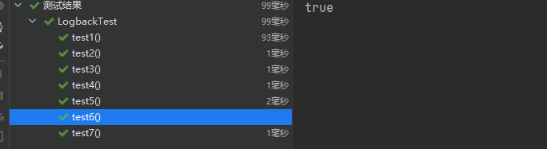

# logback

## 介绍

Logback继承自log4j。Logback的架构非常的通用，适用于不同的使用场景。


logback和Log4j都是slf4j规范的具体实现，我们在程序中直接调用的API其实都是slf4j的api，底层则是真正的日志实现组件---logback或者log4j。

Logback 构建在三个主要的类上：Logger，Appender 和 Layout。这三个不同类型的组件一起作用能够让开发者根据消息的类型以及日志的级别来打印日志。 


**Logger**作为日志的记录器，把它关联到应用的对应的context后，主要用于存放日志对象，也可以定义日志类型、级别。各个logger 都被关联到一个 LoggerContext，LoggerContext负责制造logger，也负责以树结构排列各 logger。

**Appender**主要用于指定日志输出的目的地，目的地可以是控制台、文件、 数据库等。

**Layout** 负责把事件转换成字符串，输出格式化的日志信息。


logback的maven坐标：

```xml
<dependency>
    <groupId>ch.qos.logback</groupId>
    <artifactId>logback-classic</artifactId>
    <version>1.2.3</version>
</dependency>
<dependency>
    <groupId>ch.qos.logback</groupId>
    <artifactId>logback-core</artifactId>
    <version>1.2.3</version>
</dependency>
```


## logback层级

在 logback中每一个 logger 都依附在 LoggerContext 上，它负责产生 logger，并且通过一个**树状**的层级结构来进行管理。

一个 Logger 被当作为一个实体，它们的命名是大小写敏感的，并且遵循以下规则：

* 如果一个logger的名字加上一个.作为另一个logger名字的前缀，那么该logger就是另一个logger的祖先。如果一个logger与另一个logger之间没有其它的logger，则该logger就是另一个logger的父级。


在logback中有一个root logger，它是logger层次结构的最高层，它是一个特殊的logger，因为它是每一个层次结构的一部分


## logback日志输出等级

logback的日志输出等级分为：TRACE, DEBUG, INFO, WARN, ERROR。

如果一个给定的logger没有指定一个日志输出等级，那么它就会继承离它最近的一个祖先的层级。

为了确保所有的logger都有一个日志输出等级，root logger会有一个默认输出等级 --- DEBUG。


## logback初始化步骤

1. logback会在类路径下寻找名为logback-test.xml的文件
2. 如果没有找到，logback会继续寻找名为logback.groovy的文件
3. 如果没有找到，logback会继续寻找名为logback.xml的文件
4. 如果没有找到，将会在类路径下寻找文件META-INFO/services/ch.qos.logback.classic.spi.Configurator，该文件的内容为实现了Configurator接口的实现类的全限定类名
5. 如果以上都没有成功，logback会通过BasicConfigurator为自己进行配置，并且日志将会全部在控制台打印出来

最后一步的目的是为了保证在所有的配置文件都没有被找到的情况下，提供一个默认的配置。


## logback入门案例

### 案例一


#### 第一步：创建maven工程logback_demo


#### 第二步：修改pom文件


```xml
<?xml version="1.0" encoding="UTF-8"?>
<project xmlns="http://maven.apache.org/POM/4.0.0"
         xmlns:xsi="http://www.w3.org/2001/XMLSchema-instance"
         xsi:schemaLocation="http://maven.apache.org/POM/4.0.0 http://maven.apache.org/xsd/maven-4.0.0.xsd">
    <modelVersion>4.0.0</modelVersion>
    <!--
      -maven项目核心配置文件-
    Project name(项目名称)：logback_demo
    Author(作者）: mao
    Author QQ：1296193245
    GitHub：https://github.com/maomao124/
    Date(创建日期)： 2022/10/31
    Time(创建时间)： 18:52
    -->
    <groupId>mao</groupId>
    <artifactId>logback_demo</artifactId>
    <version>1.0</version>

    <properties>
        <maven.compiler.source>16</maven.compiler.source>
        <maven.compiler.target>16</maven.compiler.target>
    </properties>
    
    <dependencies>

        <dependency>
            <groupId>ch.qos.logback</groupId>
            <artifactId>logback-classic</artifactId>
            <version>1.3.4</version>
        </dependency>
        <dependency>
            <groupId>ch.qos.logback</groupId>
            <artifactId>logback-core</artifactId>
            <version>1.3.4</version>
        </dependency>

        <!-- 测试框架 -->
        <dependency>
            <groupId>org.junit.jupiter</groupId>
            <artifactId>junit-jupiter</artifactId>
            <version>RELEASE</version>
            <scope>test</scope>
        </dependency>

    </dependencies>

    <build>
        <finalName>logback_demo</finalName>
        <plugins>
            <plugin>
                <groupId>org.apache.maven.plugins</groupId>
                <artifactId>maven-jar-plugin</artifactId>
                <configuration>
                    <archive>
                        <manifest>
                            <mainClass>Test</mainClass>
                            <!--更改项，主类名-->
                        </manifest>
                    </archive>
                </configuration>
            </plugin>
        </plugins>
    </build>

</project>
```


#### 第三步：编写单元测试


```java
package mao;

import ch.qos.logback.classic.Level;
import ch.qos.logback.classic.LoggerContext;
import ch.qos.logback.core.util.StatusPrinter;
import org.junit.jupiter.api.Test;
import org.slf4j.Logger;
import org.slf4j.LoggerFactory;

/**
 * Project name(项目名称)：logback_demo
 * Package(包名): mao
 * Class(类名): LogbackTest
 * Author(作者）: mao
 * Author QQ：1296193245
 * GitHub：https://github.com/maomao124/
 * Date(创建日期)： 2022/10/31
 * Time(创建时间)： 18:56
 * Version(版本): 1.0
 * Description(描述)： 无
 */


public class LogbackTest
{
    //简单使用
    @Test
    public void test1()
    {
        Logger logger = LoggerFactory.getLogger("mao.logback.HelloWorld");
        logger.debug("debug ...");
    }

    //打印日志内部状态
    @Test
    public void test2()
    {
        Logger logger = LoggerFactory.getLogger("mao.logback.HelloWorld");
        logger.debug("debug ...");
        // 打印内部的状态
        LoggerContext lc = (LoggerContext) LoggerFactory.getILoggerFactory();
        StatusPrinter.print(lc);
    }

    /*
     * 日志输出级别：ERROR > WARN > INFO > DEBUG > TRACE
     * */

    //测试默认的日志输出级别
    @Test
    public void test3()
    {
        Logger logger = LoggerFactory.getLogger("mao.logback.HelloWorld");
        logger.error("error ...");
        logger.warn("warn ...");
        logger.info("info ...");
        logger.debug("debug ...");
        //因为默认的输出级别为debug，所以这一条日志不会输出
        logger.trace("trace ...");
    }

    //设置日志输出级别
    @Test
    public void test4()
    {
        ch.qos.logback.classic.Logger logger = (ch.qos.logback.classic.Logger) LoggerFactory.getLogger("mao.logback.HelloWorld");
        logger.setLevel(Level.WARN);
        logger.error("error ...");
        logger.warn("warn ...");
        logger.info("info ...");
        logger.debug("debug ...");
        logger.trace("trace ...");
    }

    //测试Logger的继承
    @Test
    public void test5()
    {
        ch.qos.logback.classic.Logger logger =
                (ch.qos.logback.classic.Logger) LoggerFactory.getLogger("mao");
        logger.setLevel(Level.INFO);
        logger.error("error ...");
        logger.warn("warn ...");
        logger.info("info ...");
        logger.debug("debug ...");
        logger.trace("trace ...");

        // "mao.logback" 会继承 "mao" 的有效级别
        Logger barLogger = LoggerFactory.getLogger("mao.logback");
        // 这条日志会打印，因为 INFO >= INFO
        barLogger.info("子级信息");
        // 这条日志不会打印，因为 DEBUG < INFO
        barLogger.debug("子级调试信息");
    }

    //Logger获取，根据同一个名称获得的logger都是同一个实例
    @Test
    public void test6()
    {
        Logger logger1 = LoggerFactory.getLogger("mao");
        Logger logger2 = LoggerFactory.getLogger("mao");
        System.out.println(logger1 == logger2);
    }

    //参数化日志
    @Test
    public void test7()
    {
        Logger logger = LoggerFactory.getLogger("mao");
        logger.debug("hello {}", "world");
    }
}
```





### 案例二

